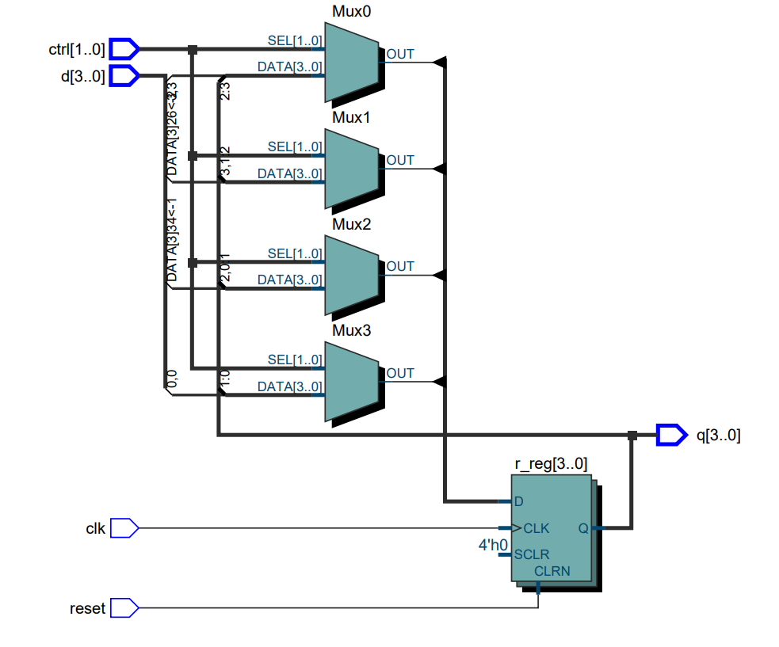
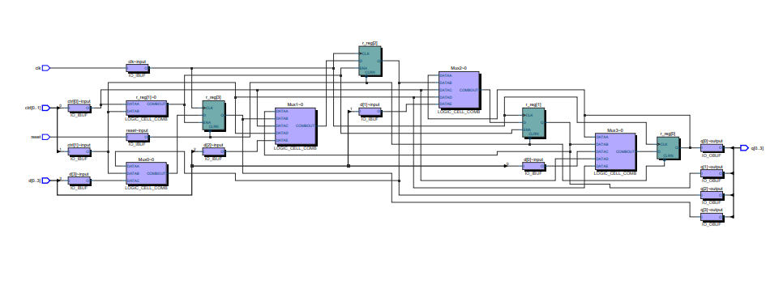

# universal-shift-register-using-VHDL
 A universal shift register can load a parallel data word and  perform shifting in either direction. There are four operations: load, shift right, shift left  and pause. A control signal, ctrl, specifies the desired operation. 

  
**This project will implement the following universal shift register circuit using VHDL**

The folloiwng picture shows The RTL view of the Universal shift register

The following picture shows the Technology map view of Universals shift register

Tewodros Seble
 
All Rights Reserved
